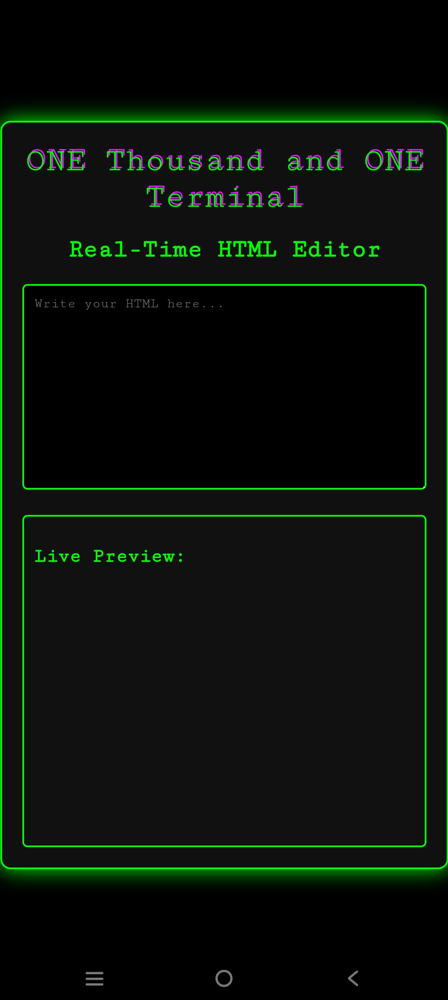

# ONE Thousand and ONE Terminal - Real-Time HTML Editor

This is a **Real-Time HTML Coding App** designed with a **hacker terminal theme**, inspired by cyberpunk aesthetics and the elite hacker team **ONE Thousand and ONE**. It delivers a dark, digital vibe, making coding feel dangerous and powerful.

---

## ⚡ Features:
- **Hacker-Themed Design**: Dark background and neon green text for a retro terminal look.  
- **Live HTML Preview**: Instantly see the output as you type HTML code.  
- **Glitch Animation**: The title has a glitch effect, enhancing the digital and dangerous atmosphere.  
- **Minimal and Fast**: Built with pure HTML, CSS, and JavaScript. No external libraries needed.  

---

## 🎨 Screenshot:


---

## 🚀 Live Demo:
Check out the live version here: [ONE Thousand and ONE Terminal](https://onethousandandone-1001.github.io/REAL-TIME-HTML/)

---

## 🚀 How to Use:
1. **Clone the repository**:
    ```bash
    git clone https://github.com/your-username/your-repo-name.git
    cd your-repo-name
    ```
2. **Open the file**:
    Just open the `index.html` file in your favorite browser.

---

## 🛠️ Technologies Used:
- **HTML** - Structure and Real-Time Editor.  
- **CSS** - Hacker-themed styling with neon green text.  
- **JavaScript** - Live preview functionality.  

---

## 👻 About ONE Thousand and ONE:
This project is inspired by the elite hacker team **ONE Thousand and ONE**, known for their expertise in **Cybersecurity and Web Hacking**.  

---

## ⚖️ License:
This project is licensed under the MIT License. Feel free to use and modify it.  

---

## 📫 Contact:
For any queries or collaboration, contact **Md Arafat Hossen Mugdho**.  
- **Team**: ONE Thousand and ONE  
- **GitHub**: [ONE Thousand and ONE](https://github.com/onethousandandone-1001)  

---

## ⭐ Support:
If you find this project useful, please **Star** this repository and share it with others!

---

## 📷 Screenshot:
Make sure to take a screenshot of the app in action and save it as `screenshot.png` in the repository folder for it to show up in the README.

---

## 🔥 Feel the Power. Code Like a Ghost. 🔥
